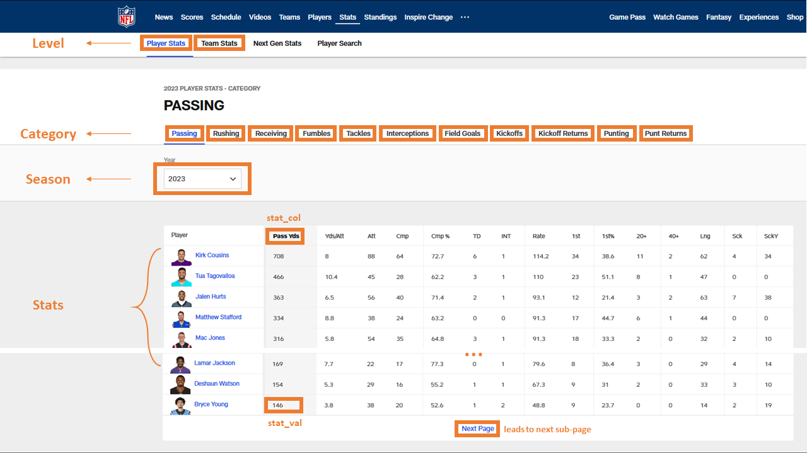
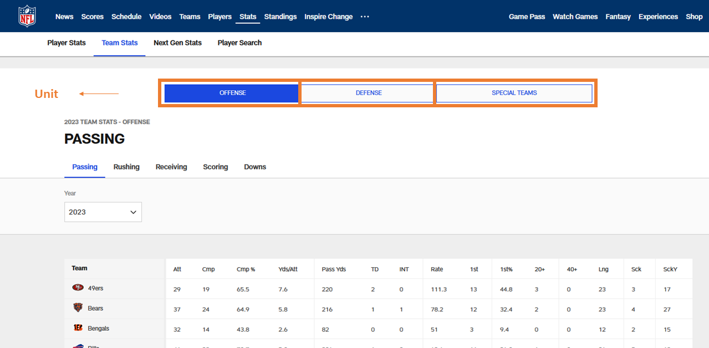
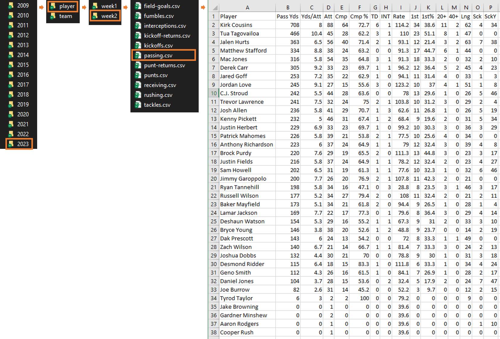
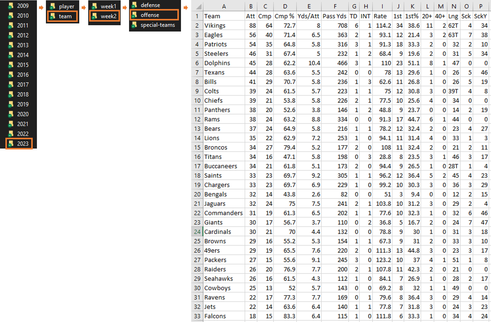

# NFL Statistics Scraper

This Python script allows you to scrape NFL player and team statistics from the official NFL website and store the data in an organized format. You can specify the season and level (player or team) for which you want to retrieve statistics. The script also handles pagination to collect data from multiple pages efficiently. Please note that this a project for educational/personal use only. I do not own the rights to the NFL data.

## Table of Contents

- [Introduction](#introduction)
- [Getting Started](#getting-started)
  - [Prerequisites](#prerequisites)
  - [Installation](#installation)
- [Usage](#usage)
  - [Parameters](#parameters)
  - [Website Layout](#The-Website-Layout)
  - [Usage](#usage)
- [Functions](#functions)
  - [get_links](#get_links)
  - [get_sub_pages](#get_sub_pages)
  - [format_links](#format_links)
  - [create_directory_if_not_exists](#create_directory_if_not_exists)
  - [scrape_and_process_data](#scrape_and_process_data)
  - [get_stats](#get_stats)
- [Directory Structure](#directory-structure)
- [Data Storage](#data-storage)
- [Contributing](#contributing)

## Introduction

The script is designed to scrape NFL player and team statistics data from the official NFL website. It provides a set of functions to:

- Retrieve links to statistics pages for player or team statistics.
- Collect sub-pages for different statistics categories and handle pagination.
- Format and organize the collected links for easy access.
- Create a directory structure to store the scraped data.
- Scrape and process data for specific categories and save it as CSV files.

## Getting Started

### Prerequisites

Before you begin, ensure you have the following requirements:

- Python 3.x
- Required Python packages (`pandas`, `requests`, `bs4`)

### Installation

1. Clone this repository to your local machine:

   ```
   git clone <repository-url>
   ```

2. Install the required Python packages using pip:

   ```
   pip install pandas requests beautifulsoup4
   ```

## Usage

### Parameters

- `level` (str): The statistics level, either "player" or "team".
- `season` (str): The NFL season for which statistics are retrieved.

### Usage
To use the NFL Statistics Scraper script (scrape.ipnyb), follow these steps:

### Import Functions

First, import the necessary functions from the `functions.ipynb` file. You can do this using the `%run` magic command in Jupyter Notebook, or you can import the functions directly in Python. Ensure that the `functions.ipynb` file contains the required functions for data scraping.

```python
# Import functions from functions.ipynb
%run functions.ipynb
```

### Import Libraries

Next, import the `datetime` library, which is used to calculate the current NFL season and week.

```python
import datetime
```

### Set Parameters

Set the parameters for the scraping process. This includes calculating the current NFL season and week based on the current date.

```python
# Get the current date
current_date = datetime.date.today()

# Define the start date of an NFL season (in 2023: 07. September)
nfl_season_start_date = datetime.date(current_date.year, 9, 7)

# Calculate the current NFL season
if current_date < nfl_season_start_date:
    current_season = current_date.year - 1
else:
    current_season = current_date.year

# Calculate the current NFL week (assuming a 17-week regular season)
days_since_season_start = (current_date - nfl_season_start_date).days
current_week = min((days_since_season_start // 7) + 1, 17)

# Print the current season and week
print("Current NFL Season:", current_season)
print("Current NFL Week:", current_week)
```
### Website Layout
The NFL website consists of different tabs and columns. Here is the website layout and the corresponding terms used within the code:

Player level



Team level



### Scrape Data

Now, you can initiate the data scraping process. There are two main scenarios for data retrieval:

#### Get Current Season Data

To retrieve statistics data for the current season, use the `get_stats` function. Specify the level ("player", "team", or both using a for loop) and the desired season.

```python
# Get stats for both player and team levels in the specified season (e.g., "1990")
for level in ["player", "team"]:
    get_stats(level, season="1990")
```


#### Get Historic Data

To retrieve historical statistics data, create a list of years as strings, starting from 1970 up to the season just before the current season. Then, loop through the seasons and levels to retrieve data.


```python
# Create a list of years as strings since 1970
seasons = [str(year) for year in range(1970, current_season - 1)]

# Loop through seasons and levels to retrieve historical data
for season in seasons:
    for level in ["player", "team"]:
        get_stats(level, season)
```

That's it! You can customize the parameters and seasons based on your specific data retrieval needs.


## Functions

The NFL Statistics Scraper script consists of several functions that serve specific purposes in the data scraping process. Below, you'll find detailed explanations and code snippets for each function.

### get_links
- This function retrieves statistics links based on the specified level and season.
- It starts by making an HTTP request to the NFL website and parsing the HTML content.
- Depending on the level ("player" or "team"), it identifies the appropriate HTML elements containing the links.
- It extracts the href values from anchor tags and stores them in the `all_links` list.
- The function then replaces "2023" (hardcoded) with the specified season to create the final list of links.

### get_sub_pages
- The `get_sub_pages` function collects sub-pages for different statistics categories.
- It takes the `unit_links` dictionary as input, which contains unit-specific statistics links.
- The function navigates through pagination, starting from the provided links, to collect data from multiple pages.
- It maintains a dictionary structure (`sub_pages`) to store sub-pages for each unit and category.
- The `sub_pages` dictionary is organized hierarchically, making it easy to access sub-pages for specific units and categories.

### format_links
- The `format_links` function organizes and formats statistics links for easy access.
- Depending on the level ("player" or "team") and season, it retrieves links using the `get_links` function.
- It creates a dictionary (`team_stats_dict`) to store the links categorized by unit (e.g., "individual," "offense") and category (e.g., "passing," "rushing").
- The function also collects stat category names and updates the `unit_links` dictionary with the fetched links.
- It calls the `get_sub_pages` function to further organize sub-pages for each unit and category.

### create_directory_if_not_exists
- The `create_directory_if_not_exists` function checks whether a directory exists at the specified path.
- If the directory doesn't exist, it creates it using `os.makedirs(directory_path)`.
- It provides feedback through print statements, indicating whether the directory was created or if it already exists.

### scrape_and_process_data
- The `scrape_and_process_data` function scrapes data for a specific category and processes it.
- It iterates through sub-pages for the specified unit and category.
- For each sub-page, it makes an HTTP request, parses the HTML, and extracts statistical data.
- The function organizes the data into a DataFrame and appends it to a list (`category_dfs`) for the current category.
- After processing all sub-pages, it concatenates the DataFrames into one and removes duplicated parts from the "Team" column (if present).
- It checks if the directory for the unit exists and creates it if necessary.
- The processed data is then exported to a CSV file in the unit's directory.

### get_stats
- The `get_stats` function initiates the data scraping process for player or team statistics.
- It combines the base directory path with the current season and week to determine the data storage directory.
- Depending on the level ("player" or "team"), it iterates through units and categories, calling the `scrape_and_process_data` function to scrape and process data.

These functions work together to scrape, process, and organize NFL statistics data for different levels (player and team) and seasons.

## Directory Structure

The script creates a directory structure to store the scraped data:

```
data/
  <season>/ (e.g., "2022")
    <level>/ (e.g., "player" or "team")
      week<current_week>/ (for current season, player-level data only)
      <unit>/ (e.g., "offense", "defense", "special-teams")
        <category>.csv (CSV files containing statistics data)
```
Note: If you insert the current season as season (season = current_season), the output will be stored in a folder indicating the current week. However, the stats indicate **cumulative** data. Thus, data stored in a folder called "week 3" does not store stats from week 3 but stats aggregated from all previous weeks *until* week 3.

## Data Storage

The scraped data is stored in CSV files within the appropriate directories. Each CSV file contains statistics data for a specific category.


### Player-level stats:
Using the "passing" category as an example, the python script scrapes these pages ([Page 1](https://www.nfl.com/stats/player-stats/category/passing/2023/reg/all/passingyards/desc), [Page 2](https://www.nfl.com/stats/player-stats/category/passing/2023/REG/all/passingyards/DESC?aftercursor=AAAAGQAAABlAYkAAAAAAADFleUp6WldGeVkyaEJablJsY2lJNld5SXhORFlpTENJek1qQXdOVGswWmkwMU5URXlMVFEzTmpNdFlXSXlOQzFqTVdKa01EVXhaV1l3WldZaUxDSXlNREl6SWwxOQ==)) and outputs them in this structure:



### Team-level stats:
Using the "passing" category as an example, the python script scrapes this [page](https://www.nfl.com/stats/team-stats/offense/passing/2023/reg/all) and outputs it in this structure:



*Note:* In both cases the "week" folders only exist for the current season. They are not available for historic data. Instead, for historic data, the csv files are placed within the "player" or "team" folders.


## Contributing

Feel free to contribute to this project by submitting issues or pull requests. Your contributions are welcome!

---

**Note**: This README provides an overview of the script's functionality. For detailed documentation and usage examples, refer to the comments and docstrings within
